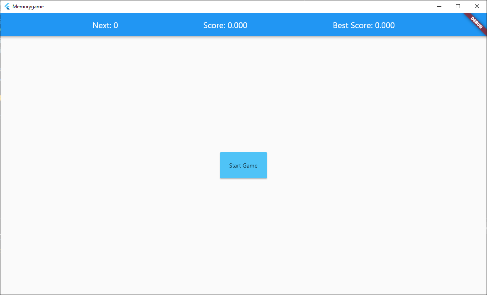
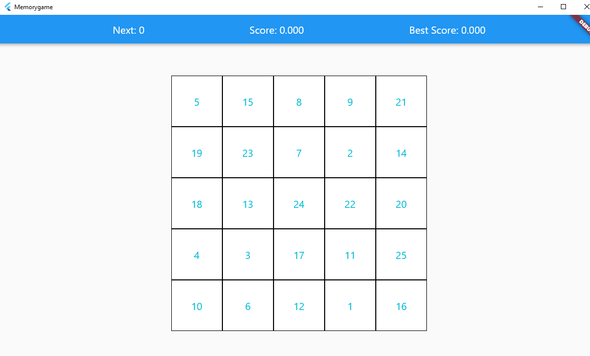
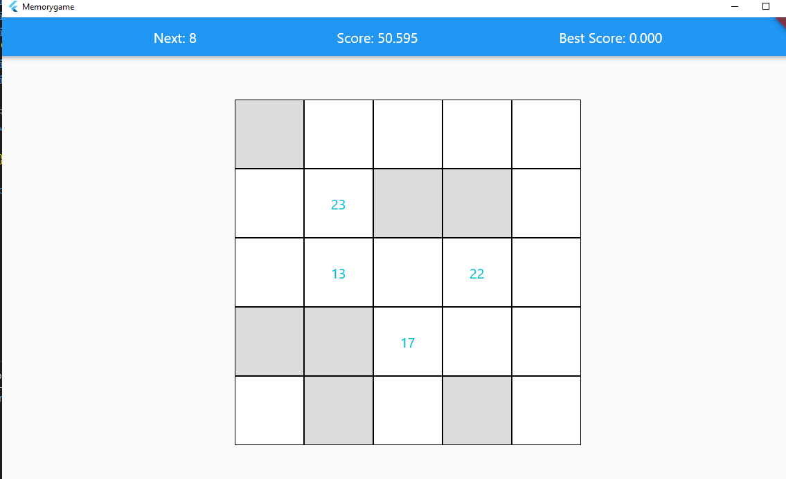
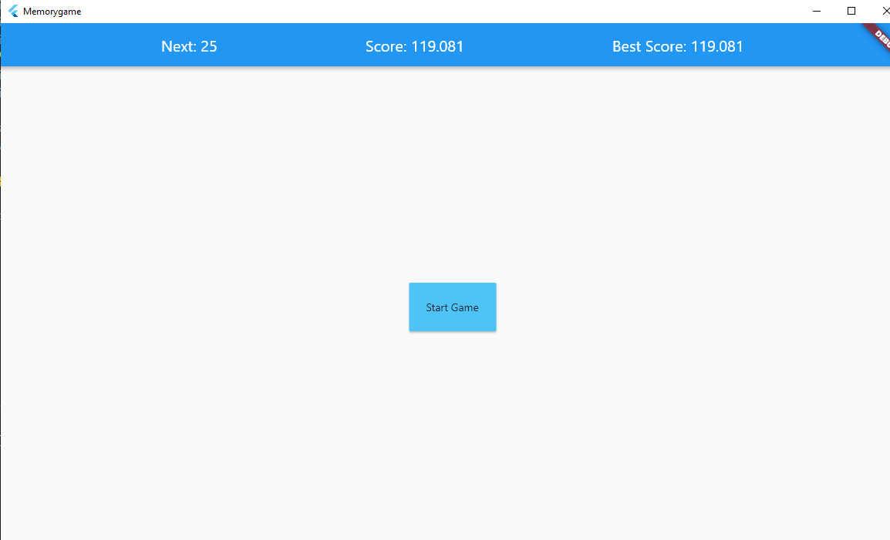

### Project Information
--- 
* Project Name:  
Memory Game
 

* Project Team:  
Fadıl Şahin
 

* Project Start Date:  
December 2020
 

* Project State And Duration:  
Done, 2 days
 

* Project Description:  
A simple memory game to train your memory made in flutter. there is three information in appbar which are next,score,bestscore. Next shows next number to find, score shows passed time from start and bestscore shows the minimum time you have ever finished the game until now. While starting the game, there is 3 seconds memorizing phase to get numbers into memory. After that all numbers are toggled invisible. And user finds all numbers to the end.
 
 

:exclamation: --------------------------------------------------------------------------------- :exclamation:

- ***Usable apk is inside [images-and-apk](images-and-apk/Memorygame.apk) folder***

- ***Usable Executable file for windows is inside [images-and-apk](images-and-apk/Memorygame.exe) folder. Dont forget to exectue with dll file and data files.***

:exclamation: --------------------------------------------------------------------------------- :exclamation:

### Screenshots
---

### Starting Page 

### Memorizing Phase

### Finding numbers

### End Game

